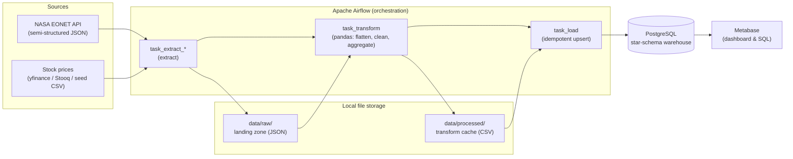
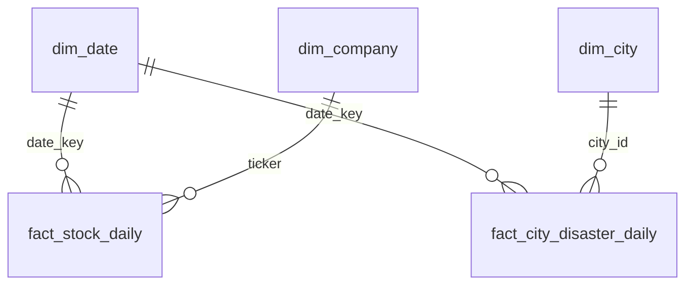

# Disaster-Stock Correlation Data Engineering Pipeline

## Project Goal

This project implements a containerized, production-style data engineering pipeline that ingests daily stock market data and NASA natural disaster events, correlates disaster intensity (wildfires, severe storms) with stock performance of property and casualty insurance companies, and loads curated facts into a PostgreSQL data warehouse using Apache Airflow orchestration.

## Use Case

Correlate the frequency and intensity of natural disasters with the stock prices of specific industries:

- **Wildfires & Severe Storms** ↔ **Insurance stocks** (e.g., Allstate - ALL)
- **Natural Disasters near cities** ↔ **Claims-sensitive insurers** (e.g., Progressive - PGR, Travelers - TRV)

## Tech Stack

- Host: Windows 11 (recommended with Docker Desktop + WSL2 backend)
- Orchestration: Apache Airflow 2.9 (Docker)
- Data Warehouse: PostgreSQL 15 (Docker)
- BI / Data Serving: Metabase 0.51.4 (Docker)
- Language: Python 3.10+
- Processing: pandas, requests, yfinance (0.2.65 + curl_cffi), psycopg2
- Data Sources: NASA EONET API (free, no key required) and daily stock prices via a resilient source chain (Stooq CSV → yfinance → Alpha Vantage → local seed CSV → deterministic simulation). In practice `yfinance` (0.2.65 + curl_cffi) is the reliable live provider, since Stooq frequently throttles automated CSV access.

## Architecture Rationale



The pipeline follows a simple lakehouse-style pattern: source APIs are first persisted unchanged as JSON files in a local landing zone, then transformed with pandas into analysis-ready CSV files, and finally loaded into a PostgreSQL warehouse. This separates extraction, transformation, and loading so each stage can be inspected and rerun independently. The raw landing zone is useful for debugging API changes and for proving that the pipeline preserves the original semi-structured EONET payload before flattening.

PostgreSQL is used as the warehouse because it is robust, SQL-native, easy to containerize, and supports upsert semantics (`ON CONFLICT`) for idempotent loads. The warehouse uses a dual-fact star schema: `fact_stock_daily` stores one closing-price observation per trading day and ticker, while `fact_city_disaster_daily` stores one disaster-proximity observation per calendar day and tracked city. They share the conformed `dim_date` dimension, and `dim_company`, `dim_city`, and `dim_event_category` provide descriptive context. This keeps analytical queries simple and makes the business question directly queryable from SQL or Metabase.

Airflow is used because it provides explicit DAG-based orchestration, retries, scheduling, observability, and task-level dependency management. The DAG is idempotent: extracting the same business date writes deterministic file names, and loading the same transformed facts updates existing warehouse rows instead of duplicating them. Docker Compose makes the environment reproducible on a fresh machine by starting PostgreSQL, Airflow, and Metabase with the same network and mounted project files.

NASA EONET is a good semi-structured source because it exposes nested JSON with event categories, geometry arrays, dates, and coordinates. Daily stock prices provide the second, independent, structured data source. The extractor walks a resilient chain so the homework stays runnable: it first attempts Stooq's keyless daily CSV, then `yfinance` (the provider that reliably returns real historical data here), then Alpha Vantage if a key is configured, then a tracked seed CSV, and finally deterministic simulated prices for arbitrary tickers. A small city reference dataset is included to turn global disaster events into a stronger business metric: the transform calculates the nearest major insured city and counts disasters within a configurable radius. This better supports the hypothesis that disasters near population centers can affect insurance, construction, or energy stocks.

## Repository Layout

```text
disaster_stock_pipeline/
├── docker-compose.yml
├── .env.example
├── .env
├── requirements.txt
├── README.md
├── ANALYTICAL_QUERIES.md         # Documented analytical SQL queries
├── doku.tex                      # Hungarian technical documentation (LaTeX)
├── docs/
│   └── img/                      # Metabase dashboard screenshots for doku.tex
├── dags/
│   └── pipeline_dag.py          # Airflow DAG: disaster_stock_correlation_pipeline
├── data/
│   ├── reference/                # Tracked city exposure reference data
│   ├── raw/                      # Raw extracts (JSON from APIs)
│   └── processed/                # Transformed CSV ready for loading
├── scripts/
│   └── create_metabase_dashboard.py  # Idempotent Metabase setup + dashboard
├── sql/
│   └── init_db.sql              # Star schema + dim_event_category seed data
└── src/
    ├── extract.py               # Fetch NASA EONET + stock market data
    ├── transform.py             # Flatten nested JSON, aggregate disaster intensity
    └── load.py                  # Idempotent load into PostgreSQL
```

## Data Model (Star Schema)

The warehouse uses a Kimball-style dimensional model with **two fact tables sharing conformed dimensions** (`sql/init_db.sql`). This dual-fact design keeps the two grains independent: stock prices exist only on trading days, while disaster proximity is tracked for every city on every calendar day.




### Dimensions

- `dim_company` (PK `ticker`): `company_name`, `sector`
- `dim_date` (PK `date_key`): `year`, `month`, `day`, `is_weekend`
- `dim_city` (PK `city_id`): `city_name`, `country`, `latitude`, `longitude`
- `dim_event_category` (PK `category_id`): `category_name` (Wildfires, Severe Storms, Floods, etc.) — reference lookup for EONET categories

### Fact 1: `fact_stock_daily`

One row per (trading day x ticker).

- `date_key` (FK → `dim_date.date_key`)
- `ticker` (FK → `dim_company.ticker`)
- `stock_close_price`, `stock_volume`, `updated_at`
- **Primary Key:** (`date_key`, `ticker`)

### Fact 2: `fact_city_disaster_daily`

One row per (calendar day x tracked city).

- `date_key` (FK → `dim_date.date_key`)
- `city_id` (FK → `dim_city.city_id`)
- `active_disaster_count` (distinct relevant disaster events active that day)
- `nearby_disaster_count` (events within `CITY_IMPACT_RADIUS_KM` of the city)
- `nearest_disaster_distance_km`, `is_nearby_disaster`, `updated_at`
- **Primary Key:** (`date_key`, `city_id`)

`dim_company` is upserted automatically during the load step (`src/load.py`) from the tickers present in the stock facts, so a fresh warehouse satisfies the `fact_stock_daily` foreign key without any manual seeding.

The two facts are joined for analysis through the SQL views in `sql/init_db.sql` (for example `vw_daily_disaster_stock_impact` and `vw_stock_disaster_price_movement`), which align stock performance with same-day disaster proximity.

## Prerequisites

- Docker Desktop installed and running
- Docker Compose enabled
- No API keys are required: NASA EONET and the stock sources (Stooq/yfinance) work key-free, and a local seed plus deterministic simulation keep the pipeline runnable if external finance sources fail

## Configuration

Create `.env` before first run:

```bash
copy .env.example .env
```

Then edit `.env` if needed:

```env
POSTGRES_USER=airflow
POSTGRES_PASSWORD=airflow
POSTGRES_HOST=postgres
POSTGRES_PORT=5432
AIRFLOW_DB=airflow
DISASTER_WAREHOUSE_DB=disaster_dw
METABASE_DB=metabase
AIRFLOW__WEBSERVER__SECRET_KEY=dev_shared_airflow_secret_key_change_me

STOCK_TICKER=ALL
STOCK_TICKERS=ALL,CB,TRV,AIG,PGR,BRK-B
STOOQ_API_KEY=
ALPHA_VANTAGE_API_KEY=

LOOKBACK_DAYS=365
ANALYSIS_START_DATE=2024-12-01
ANALYSIS_END_DATE=2025-02-28
CITY_IMPACT_RADIUS_KM=100
RELEVANT_EVENT_CATEGORIES=Wildfires,Severe Storms,Floods,Landslides,Earthquakes,Temperature Extremes,Drought
CITY_REFERENCE_PATH=/opt/airflow/data/reference/insured_cities.csv
STOCK_SEED_PATH=/opt/airflow/data/reference/stock_prices_seed.csv
MIN_SEED_MARKET_ROWS=30

STOOQ_RETRY_ATTEMPTS=1
STOOQ_RETRY_BASE_SECONDS=2
ALLOW_STOOQ_QUOTE_FALLBACK=false
YFINANCE_RETRY_ATTEMPTS=3
YFINANCE_RETRY_BASE_SECONDS=2
EONET_RETRY_ATTEMPTS=3
EONET_RETRY_BASE_SECONDS=5
EONET_LIMIT=2000
ALPHA_VANTAGE_RETRY_ATTEMPTS=5
ALPHA_VANTAGE_RETRY_BASE_SECONDS=15
```

**Key Configuration Options:**

- `STOCK_TICKERS`: Comma-separated tickers (default: `ALL,CB,TRV,AIG,PGR,BRK-B` for insurers/reinsurers exposed to wildfire claim risk)
- `ANALYSIS_START_DATE` / `ANALYSIS_END_DATE`: Default one-click analysis window. The included default is the LA wildfire period from December 2024 through February 2025.
- `LOOKBACK_DAYS`: How far back (in days) the stock extractor requests historical prices when building its source window (default: 365). Note that the *processed* analysis window is governed by `ANALYSIS_START_DATE` / `ANALYSIS_END_DATE` (backfill) or by "yesterday" (daily mode), not by this value.
- `RELEVANT_EVENT_CATEGORIES`: EONET categories considered relevant when flattening events (default includes Wildfires, Severe Storms, Floods, Landslides, Earthquakes, Temperature Extremes, Drought)
- `CITY_IMPACT_RADIUS_KM`: Distance threshold for marking an EONET event as near a tracked city
- `STOCK_SEED_PATH`: Local CSV fallback used if Stooq, yfinance, and Alpha Vantage are unavailable; missing tickers receive deterministic simulated prices
- `MIN_SEED_MARKET_ROWS`: Minimum acceptable rows from the seed CSV. Sparse seed data falls back to deterministic business-day prices.
- `STOOQ_API_KEY`: Optional Stooq CSV key only if your environment receives an API-key prompt from Stooq
- `STOOQ_SYMBOL_<TICKER>`: Optional override for Stooq symbols (default format is `<ticker>.us`, for example `all.us`)
- `ALLOW_STOOQ_QUOTE_FALLBACK`: Keep this `false` for historical analysis windows. The quote endpoint returns the latest trading day, not historical daily rows.
- `EONET_RETRY_ATTEMPTS`: NASA EONET API retry behavior with exponential backoff
- `EONET_LIMIT`: Maximum events requested from EONET for the analysis window. The default is high enough to include the January 2025 Los Angeles wildfire events.

### User-friendly ticker updates (no container restart)

You can change tickers directly in Airflow UI instead of editing `.env`.

Priority order at runtime:

1. DAG trigger config (`tickers`)
2. Airflow Variable `stock_tickers`
3. `.env` (`STOCK_TICKERS`, then `STOCK_TICKER` fallback)

Set from Airflow UI:

1. Open Admin → Variables
2. Add key: `stock_tickers`
3. Value example: `ALL,CB,TRV,AIG,PGR,BRK-B`

Optional run-specific override (Trigger DAG → Config JSON):

```json
{
    "tickers": ["ALL", "CB", "TRV"],
    "analysis_start_date": "2025-01-01",
    "analysis_end_date": "2025-01-31"
}
```

## Scheduling Model

The DAG runs `@daily` (`catchup=False`). A scheduled run picks its window adaptively:

- **Daily mode (default scheduled run):** processes only *yesterday*, so each routine run stays fast. This is the "scheduled daily pull from today" requirement.
- **Backfill mode (manual trigger with config):** processes the full historical window regardless of the run date. This is how the Dec 2024 – Feb 2025 LA wildfire period is loaded.

## Run Instructions

From the project directory:

```bash
copy .env.example .env
docker compose up -d
```

Then open:

- Airflow UI: [http://localhost:8080](http://localhost:8080) (admin / admin)
- Metabase UI: [http://localhost:3000](http://localhost:3000)

### 1. Load the historical LA wildfire window (one-time backfill)

Step-by-step in the Airflow UI:

1. Open the Airflow UI at [http://localhost:8080](http://localhost:8080) and log in with `admin` / `admin`. (After a fresh `docker compose up -d`, wait ~2–3 minutes for the containers to finish booting before the UI responds.)
2. On the **DAGs** list, find the row named `disaster_stock_correlation_pipeline`.
3. Enable it by clicking the **toggle switch** on the left of that row (it turns blue/on). A paused DAG cannot be triggered.
4. On the same row, look to the right under the **Actions** column and click the **▶ (Trigger DAG)** play button, then choose **"Trigger DAG w/ config"** from the dropdown. (You can also open the DAG first by clicking its name, then use the **▶** button in the top-right corner.)
5. In the **Configuration JSON** text box on the trigger page, paste:

```json
{ "backfill": true, "force_reprocess": true }
```

6. Click the **Trigger** button at the bottom.
7. Open the **Grid** view (DAG name → *Grid* tab) to watch progress. The run finishes in roughly 10 minutes when every task square is dark green (success).

This processes business days from `2024-12-01` to `2025-02-28` (the `ANALYSIS_START_DATE` / `ANALYSIS_END_DATE` window) for `ALL`, `CB`, `TRV`, `AIG`, `PGR`, and `BRK-B`. After it loads once, the daily schedule keeps the warehouse current with one new day per run.

> **Tip:** On some Airflow builds the **▶** play button triggers the run immediately instead of opening the **"Trigger DAG w/ config"** dropdown. If that happens, open the trigger form directly by navigating your browser to:
>
> ```
> http://localhost:8080/dags/disaster_stock_correlation_pipeline/trigger
> ```
>
> This page always shows the **Configuration JSON** box. The config must be valid JSON, e.g. `{ "backfill": true, "force_reprocess": true }`. (If a run started without config by accident, just let it finish or mark it failed, then trigger again with config, the pipeline is idempotent.)

#### Alternative: trigger from the command line

If you prefer not to use the UI, trigger the same backfill via the Airflow CLI inside the container:

```powershell
docker compose exec airflow-scheduler airflow dags unpause disaster_stock_correlation_pipeline
docker compose exec airflow-scheduler airflow dags trigger disaster_stock_correlation_pipeline --conf "{\"backfill\": true, \"force_reprocess\": true}"
```

### 2. Build the Metabase dashboard

Metabase data lives in the same Postgres instance, so it is reset by `docker compose down -v`. The provisioning script is idempotent: it performs first-run setup if needed (creating the admin user from the credentials below), connects the `disaster_dw` warehouse, and builds the **LA Wildfire Insurance Impact** dashboard.

Run it as a single line (this works in PowerShell and bash):

```powershell
docker compose exec -e MB_PASSWORD=NemAdomMeg2 airflow-scheduler python /opt/airflow/scripts/create_metabase_dashboard.py
```

Replace `NemAdomMeg2` with your own password if you change it. Defaults can be overridden with env vars (`MB_USERNAME`, `MB_BASE_URL`, `PG_*`). The script waits for Metabase to become healthy before provisioning, then prints the dashboard URL when done.

### 3. Query the warehouse

In Metabase open a native SQL question against `disaster_dw`:

```sql
SELECT *
FROM vw_daily_disaster_stock_impact
ORDER BY date_key, ticker;
```

If Metabase does not show the views immediately, run **Admin settings → Databases → Disaster DW → Sync database schema now**.

## DAG Tasks

- `task_check_api`: Validates ticker configuration
- `task_extract_eonet`: Fetches NASA EONET natural disaster events for the configured analysis window (shared across all tickers)
- `task_extract_stocks`: Fetches stock market data once per ticker for the analysis window and creates one payload per business day
- `task_transform`: Flattens nested EONET JSON using `pd.json_normalize()` and `.explode()`, filters for relevant disaster categories (Wildfires, Severe Storms), calculates nearest tracked city with the Haversine distance, aggregates disaster intensity by date, merges with stock data for each business day
- `task_load`: Idempotent upsert into warehouse dimensions (`dim_date`, `dim_company`) and both fact tables (`fact_stock_daily`, `fact_city_disaster_daily`)

## NASA EONET JSON Transformation

The pipeline demonstrates advanced pandas transformations on nested JSON:

**Input JSON Structure:**

```json
{
  "events": [
    {
      "id": "EONET_6458",
      "title": "Wildfire - Northern California",
      "categories": [{"id": 8, "title": "Wildfires"}],
      "geometries": [
        {"date": "2024-03-15T12:00:00Z", "coordinates": [-122.5, 39.8]},
        {"date": "2024-03-16T12:00:00Z", "coordinates": [-122.6, 39.9]}
      ]
    }
  ]
}
```

**Transformation Steps (in `transform.py`):**

1. `**pd.json_normalize()`** - Extract top-level event metadata
2. **Category extraction** - Pull nested category info
3. `**.explode("geometries")`** - Expand each daily geometry into separate rows
4. **Coordinate parsing** - Extract `[longitude, latitude]` from nested arrays
5. **City proximity** - Compare EONET coordinates with `data/reference/insured_cities.csv` using Haversine distance
6. **Date normalization** - Convert ISO timestamps to date objects
7. **Aggregation** - Group by date, count unique `event_id`, and count events near tracked cities
8. **Merge** - Join disaster counts with stock prices on date

## Idempotency Strategy

Loading is implemented with `INSERT ... ON CONFLICT DO UPDATE` for all dimension and fact tables. Re-running the same business date updates existing rows instead of creating duplicates.

## Example Analytical SQL Queries

### 1. Days with highest disaster intensity and corresponding stock performance

```sql
SELECT
    date_key,
    ticker,
    company_name,
    sector,
    active_disaster_count,
    nearby_disaster_count,
    city_name,
    nearest_disaster_distance_km,
    stock_close_price,
    stock_volume
FROM vw_daily_disaster_stock_impact
ORDER BY active_disaster_count DESC, date_key DESC
LIMIT 20;
```

### 2. Average disaster count by month and sector

```sql
SELECT
    year,
    month,
    sector,
    ROUND(AVG(active_disaster_count), 2) AS avg_monthly_disasters,
    ROUND(AVG(nearby_disaster_count), 2) AS avg_nearby_disasters,
    ROUND(AVG(stock_close_price), 2) AS avg_monthly_close
FROM vw_daily_disaster_stock_impact
GROUP BY year, month, sector
ORDER BY year, month, sector;
```

### 3. Disaster intensity vs. stock price movement (correlation analysis)

```sql
SELECT
    date_key,
    ticker,
    sector,
    active_disaster_count,
    nearby_disaster_count,
    stock_close_price,
    previous_close_price,
    pct_close_change
FROM vw_stock_disaster_price_movement
WHERE previous_close_price IS NOT NULL
ORDER BY nearby_disaster_count DESC, active_disaster_count DESC, date_key DESC
LIMIT 50;
```

### 4. Insurance sector performance on city-risk days

```sql
SELECT
    date_key,
    ticker,
    company_name,
    active_disaster_count,
    nearby_disaster_count,
    city_name,
    nearest_disaster_distance_km,
    stock_close_price
FROM vw_insurance_city_risk_days
ORDER BY nearby_disaster_count DESC, nearest_disaster_distance_km ASC, date_key DESC;
```

## Notes

- NASA EONET API is free and requires no API key
- Stock data extraction tries Stooq first, then yfinance, then Alpha Vantage, then `data/reference/stock_prices_seed.csv`, then deterministic simulated prices for missing tickers
- The pipeline filters for disaster categories: **Wildfires** and **Severe Storms** (configurable in `transform.py`)
- City proximity is based on `data/reference/insured_cities.csv` and `CITY_IMPACT_RADIUS_KM`
- Default stock tickers focus on disaster-sensitive industries:
  - `ALL`: Allstate (Insurance)
  - `CB`: Chubb (Insurance)
  - `TRV`: Travelers (Insurance)
  - `AIG`: American International Group (Insurance)
  - `PGR`: Progressive (Insurance)
  - `BRK-B`: Berkshire Hathaway Class B (Insurance/Reinsurance)

